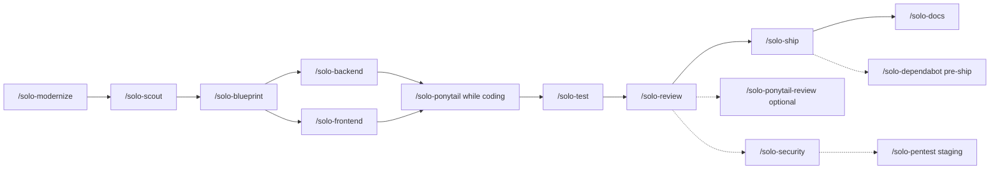

# Solo Squad — On-Demand Skills for Solo Developers

**Language:** English · [Bahasa Indonesia](../id/SOLO-SQUAD.md)

A virtual team you call when you need it — for full-stack solo workflows. All commands are **`/solo-*`**, including **`/solo-ponytail`** so you don't over-build while coding.

**Setup:** 2026-07-09 · **Version:** [1.0.0](../../CHANGELOG.md) · [Release notes](../../RELEASE-NOTES.md)  
**Install from GitHub:**

```bash
git clone https://github.com/BlackCoffeee/solo-squad.git
cd solo-squad && chmod +x scripts/*.sh && ./scripts/install.sh --lang en
```

Restart Cursor → `/solo-help`. Details: [README.md](./README.md) · Attribution: [ATTRIBUTION.md](../../ATTRIBUTION.md)

**Skill location (after install):** `~/.cursor/skills/`  
**Security:** All skills use `disable-model-invocation: true` — active only when you invoke `/skill-name`.

**Forgot a command?** Type **`/solo-help`** — shows every Solo Squad command with explanations.

**Diagrams:** use Mermaid code.

### Table of contents

0. [`/solo-help`](#solo-help--command-list) — cheat sheet for all commands
1. [Installing on macOS, Linux, and Windows](#installing-on-macos-linux-and-windows)
2. [The skills](#the-skills)
3. [How to invoke skills](#how-to-invoke-skills)
4. [Guide to each skill](#guide-to-each-skill)
5. [Which skill for which situation?](#which-skill-for-which-situation)
6. [Full example cases](#full-example-cases) (16 scenarios)
7. [Workflow (diagram)](#recommended-workflow)
8. [Choose stack](#choose-stack-scout--blueprint)
9. [Skill security](#security)
10. [File structure](#file-structure)
11. [Solo dev tips](#solo-dev-tips)
12. [Skill chaining & bundled updates](#skill-chaining-one-command)
13. [Review / security / Dependabot](#review-security--supply-chain--summary)
14. [Audit scripts](#audit-scripts)

---

## Installing on macOS, Linux, and Windows

The steps are the **same** on every OS: clone the repo → run `install.sh` → restart Cursor → `/solo-help`.

| | macOS | Linux | Windows |
|---|-------|-------|---------|
| **Terminal** | Terminal / iTerm | bash / zsh | **Git Bash** or **WSL** (not CMD/PowerShell directly) |
| **Prerequisites** | `git`, `python3` | `git`, `python3` | `git`, `python3`, Git for Windows or WSL |
| **Cursor skills path** | `~/.cursor/skills/` | `~/.cursor/skills/` | `%USERPROFILE%\.cursor\skills\` |
| **Install command** | `./scripts/install.sh` | `./scripts/install.sh` | same (in Git Bash / WSL) |

The installer requires **bash** + **Python 3** (`apply-locale.py` applies description language).

### macOS

```bash
# Prerequisite: Xcode Command Line Tools (for git) — xcode-select --install
git clone https://github.com/BlackCoffeee/solo-squad.git
cd solo-squad
chmod +x scripts/*.sh
./scripts/install.sh --lang en    # or --lang id
```

Python 3 is usually preinstalled. Check: `python3 --version`.

**Skills path:** `/Users/<username>/.cursor/skills/`

### Linux

```bash
# Debian/Ubuntu example prerequisites:
# sudo apt update && sudo apt install -y git python3

git clone https://github.com/BlackCoffeee/solo-squad.git
cd solo-squad
chmod +x scripts/*.sh
./scripts/install.sh --lang en
```

On Fedora/Arch, install `git` and `python3` via your distro package manager.

**Skills path:** `/home/<username>/.cursor/skills/`

### Windows — Git Bash (recommended)

The installer is a **bash script**, not `.ps1` / `.bat`. Use **Git Bash** (ships with [Git for Windows](https://git-scm.com/download/win)).

```bash
git clone https://github.com/BlackCoffeee/solo-squad.git
cd solo-squad
chmod +x scripts/*.sh
./scripts/install.sh --lang en
```

If `python3` is not found, try:

```bash
python --version
# or install Python from https://python.org (check "Add to PATH")
```

**Skills path:** `C:\Users\<username>\.cursor\skills\`

Cursor on Windows reads the same folder — skills appear after restarting the IDE.

### Windows — WSL (alternative)

Run the install inside WSL (Ubuntu, etc.). Skills install to the Linux WSL home:

```bash
git clone https://github.com/BlackCoffeee/solo-squad.git
cd solo-squad
chmod +x scripts/*.sh
./scripts/install.sh --lang en
```

**Note:** Skills path = `~/.cursor/skills/` **inside WSL**. Cursor Desktop on Windows typically uses `%USERPROFILE%\.cursor\skills\`. If skills do not show up, copy manually:

```bash
# From WSL — adjust Windows username
cp -r ~/.cursor/skills/solo-* /mnt/c/Users/<WindowsUser>/.cursor/skills/
```

Or clone + install directly in **Git Bash** so paths match Cursor on Windows.

### Install options (all platforms)

```bash
./scripts/install.sh                  # language prompt (id/en) when interactive
./scripts/install.sh --lang id        # Indonesian skill descriptions
./scripts/install.sh --lang en        # English descriptions
./scripts/install.sh --dry-run        # preview without writing files
SOLO_LANG=en ./scripts/install.sh     # via environment variable
SOLO_SKILLS_DIR=/custom/path ./scripts/install.sh
```

Language is stored in `~/.cursor/skills/.solo-squad-lang`.

### Verify after install

1. **Restart Cursor** (or open a new Agent chat)
2. Type **`/solo-help`** — command list should appear
3. Type **`/`** — should list `solo-scout`, `solo-backend`, `solo-ponytail`, etc.
4. **Customize → Skills** — 19 `solo-*` skills under **User** scope

### Manual install (without script)

If bash/Python is unavailable, copy skill folders manually:

```text
skills/solo-*  →  ~/.cursor/skills/
```

Without `install.sh`, descriptions are **not** localized (`--lang` won't apply) and help references may stay as `.id.md` / `.en.md` — using the script is recommended.

### Install troubleshooting

| Issue | Fix |
|-------|-----|
| `Permission denied` on `./scripts/install.sh` | `chmod +x scripts/*.sh` |
| `python3: command not found` (Windows) | Install Python; try `python scripts/apply-locale.py` |
| Skills missing in Cursor | Restart Cursor; verify `~/.cursor/skills/solo-help/SKILL.md` exists |
| Installed in WSL, Cursor Windows can't see skills | Copy to `/mnt/c/Users/.../.cursor/skills/` or use Git Bash |
| Change description language | Re-run `./scripts/install.sh --lang en` |

Once install succeeds, continue to [The skills](#the-skills).

---

## The skills

| Skill | Role | When to use |
|-------|------|-------------|
| `/solo-help` | **Cheat sheet** for all commands | Forgot a command, onboarding, quick overview |
| `/solo-status` | Check which skills are **still active** in this chat | After several `/solo-*`, before switching topics |
| `/solo-modernize` | Legacy + **improve-codebase-architecture** + **incremental-implementation** | Legacy audit, migration strategy — **phase 0** |
| `/solo-scout` | Analyst + **grill-me-product** (integrated) | Assumption interview, scope, stack |
| `/solo-add-feature` | **Orchestration** for new features in existing apps + **incremental-implementation** | Add module to existing codebase — scout→ship playbook |
| `/solo-blueprint` | Planner + **grill-me-architecture** + Mermaid | Phases, tasks, architecture diagrams |
| `/solo-backend` | Backend dev + **Engineering Best Practices** (integrated) | Laravel, API, DB, OWASP — one command |
| `/solo-frontend` | Frontend dev + **Taste Skill** (integrated) | Next, React, Blade — one command, anti-slop UI |
| `/solo-test` | QA + **Test-Driven Development** (integrated) | Strategy, write tests, run, red-green-refactor |
| `/solo-review` | Review + **Code Review and Quality** (integrated) | Before merge — 5 axes: correctness, readability, architecture, security, performance |
| `/solo-security` | Audit + **Security and Hardening** (integrated) | Finished app, auth/payment/PII, STRIDE threat model, OWASP |
| `/solo-pentest` | Web pentest + **Web Pentest / OWASP WSTG** (integrated) | Staging/localhost — runtime verification after `/solo-security` |
| `/solo-dependabot` | Check **GitHub Dependabot** alerts + supply chain triage | Before deploy, routine audit, after dependency bump |
| `/solo-ship` | Release + **Shipping and Launch** (integrated) | Tag, changelog, deploy checklist, rollback |
| `/solo-docs` | Docs + **Documentation and ADRs** (integrated) | System docs, user guides, ADR |
| `/solo-ponytail` | Lazy senior | During **implementation** — don't over-build |
| `/solo-ponytail-ultra` | Ponytail at extreme intensity | Requirements can be trimmed; delete first |
| `/solo-ponytail-review` | Bloat review only | Optional after `/solo-review` if focus is over-engineering |
| `/solo-ponytail-status` | Check if Ponytail is active in this chat | Answer: **YES** or **NO** only |

---

## `/solo-help` — command list

Shows **every Solo Squad command** (and related Cursor subagents), with a short note on when to use each one.

| Syntax | Output |
|--------|--------|
| `/solo-help` | Full catalog (all sections) |
| `/solo-status` | Skills still active in this chat |
| `/solo-help plan` | modernize, scout, add-feature, blueprint |
| `/solo-help build` | backend, frontend, solo-ponytail |
| `/solo-help quality` | test, review, solo-ponytail-review |
| `/solo-help security` | security, pentest, dependabot, review-security |
| `/solo-help release` | ship, docs |
| `/solo-help solo-ponytail` | solo-ponytail, solo-ponytail-ultra, solo-ponytail-review, solo-ponytail-status |
| `/solo-help scout` | Detail for one skill (replace `scout` with skill name) |

`/solo-help` answers once, then done. For the full guide, see this document. To see what's still on: **`/solo-status`**.

---

### `/solo-status` — what's still active

Reads **this chat history**, then lists Solo Squad skills that have not been stopped.

| Syntax | Output |
|--------|--------|
| `/solo-status` | List of active `/solo-*`, or “none active” |

**One answer, then done** (same as `/solo-help`). Does not turn skills on or off.

**Example:**

```text
Active in this chat:
- /solo-backend
- /solo-ponytail

Stop: stop [name] · or normal mode
```

---

## How to invoke skills

### Basics

1. Type **`/skill-name`** in Cursor chat (e.g. `/solo-scout`).
2. Add **context** after the skill name — feature, module, scope, or a short instruction.
3. The skill **stays active** in that chat until you type a stop command (see below).
4. Open the **relevant project folder** as workspace — skills read code in the active repo.

```text
/solo-help                      # see all commands
/solo-status                    # check which skills are still active
/solo-scout employee attendance system
/solo-add-feature export PDF monthly report
/solo-blueprint reports module
/solo-backend PDF export API
/solo-frontend dashboard page
/solo-test auth module
/solo-review                    # review git diff
/solo-security audit full-app
/solo-pentest staging https://staging.app.com auth module
/solo-dependabot critical
/solo-ship minor
/solo-docs both
/solo-ponytail                       # active during implementation
```

### Two skills in one message

Cursor can load more than one skill at once:

```text
/solo-backend /solo-ponytail implement login endpoint
/solo-frontend /solo-ponytail minimal registration form
```

Use during **implementation** — Ponytail keeps solutions minimal; dev skills handle the stack.

### Skills vs built-in Cursor subagents

| Type | Example | When |
|------|---------|------|
| **Solo Squad skill** | `/solo-security` | Persona + bundled reference in the same chat |
| **Subagent** | `/review-security` | Separate context; security-focused diff audit |
| **Subagent** | Task `explore` | Large codebase; invoked by agent when needed |

Subagents do **not** replace Solo Squad — pair them after the main skill if you need a second opinion.

### Disable skills

| Command | Effect |
|---------|--------|
| `stop scout` | Disable `/solo-scout` |
| `stop add-feature` | Disable `/solo-add-feature` |
| `stop blueprint` | Disable `/solo-blueprint` |
| `stop modernize` | Disable `/solo-modernize` |
| `stop solo-backend` | Disable `/solo-backend` |
| `stop solo-frontend` | Disable `/solo-frontend` |
| `stop solo-test` | Disable `/solo-test` |
| `stop solo-review` | Disable `/solo-review` |
| `stop solo-security` | Disable `/solo-security` |
| `stop solo-pentest` | Disable `/solo-pentest` |
| `stop solo-dependabot` | Disable `/solo-dependabot` |
| `stop solo-ship` | Disable `/solo-ship` |
| `stop solo-docs` | Disable `/solo-docs` |
| `stop solo-ponytail` | Disable Ponytail |
| `normal mode` | Disable all persona skills |

---

## Guide to each skill

### `/solo-modernize` — legacy phase 0

**When:** Old app, framework upgrade, stack migration, audit before major refactor.

| Example syntax | Output |
|----------------|--------|
| `/solo-modernize` | Audit active repo |
| `/solo-modernize upgrade Laravel 8 to 12` | In-place strategy + roadmap |
| `/solo-modernize monolith PHP to Laravel + Inertia` | Strangler / incremental |

**Not for:** New greenfield features from scratch (go straight to `/solo-scout`).

**Stop:** `stop modernize` · **Next:** `/solo-scout` on **one slice** of phase 1.

---

### `/solo-scout` — analysis & scope

**When:** New idea, new feature, migration phase, or unclear scope.

| Example syntax | Output |
|----------------|--------|
| `/solo-scout campus meeting room booking system` | Assumption interview + scope + stack |
| `/solo-scout phase 1: auth module only` | Limited scope (after modernize) |
| `/solo-scout do we need microservices?` | Monolith vs split recommendation |

**Not for:** Architecture diagrams (use `/solo-blueprint`).

**Stop:** `stop scout` · **Next:** `/solo-blueprint` or `/solo-add-feature` if app already exists.

---

### `/solo-add-feature` — add feature to existing app

**When:** New feature in a **running codebase** — not greenfield, not full modernize.

| Example syntax | Output |
|----------------|--------|
| `/solo-add-feature email notification for booking` | Recon patterns → scope → slice plan → next command |
| `/solo-add-feature continue phase 2` | Continue blueprint-lite if scope is OK |
| `/solo-add-feature status` | Playbook position + next skill |

**Bundled:** [addyosmani/agent-skills](https://github.com/addyosmani/agent-skills) — `incremental-implementation`.

**Stop:** `stop add-feature` · **Pair:** `/solo-backend /solo-ponytail`, `/solo-test`, `/solo-review`, `/solo-ship`.

**Not for:** brand-new project from scratch (`/solo-scout`) · broken legacy app (`/solo-modernize`).

---

### `/solo-blueprint` — plan & Mermaid diagrams

**When:** After scout; need phases, task list, diagrams.

| Example syntax | Output |
|----------------|--------|
| `/solo-blueprint booking module` | Phases + checklist + ≥2 Mermaid diagrams |
| `/solo-blueprint auth strangler migration` | Dual-run architecture + risks |

**Required:** All diagrams = ` ```mermaid ` blocks.

**Stop:** `stop blueprint` · **Next:** `/solo-backend`, `/solo-frontend`, `/solo-ponytail`.

---

### `/solo-backend` — backend implementation

**When:** API, migration, model, server-side auth, job, DB integration.

| Example syntax | Output |
|----------------|--------|
| `/solo-backend booking CRUD API` | Code + validation + smoke test |
| `/solo-backend /solo-ponytail webhook endpoint` | Minimal implementation |
| `/solo-backend payments table migration` | Migration + model |

**Stack:** Auto-detected (Laravel, Node, Go, Python).

**Stop:** `stop solo-backend` · **Pair:** `/solo-ponytail`, `/solo-test`, `/solo-security` (auth/payment).

---

### `/solo-frontend` — frontend implementation + Taste

**When:** Pages, components, API wiring, public/landing UI.

| Example syntax | Output |
|----------------|--------|
| `/solo-frontend booking page` | Route + components + states |
| `/solo-frontend product landing page` | Taste Skill anti-slop |
| `/solo-frontend admin dashboard` | Project patterns (light Taste) |

**Stop:** `stop solo-frontend` · **Pair:** `/solo-ponytail` if UI is bloated.

---

### `/solo-test` — testing & TDD

**When:** Before merge, after bug fix, regression, new feature.

| Example syntax | Output |
|----------------|--------|
| `/solo-test` | Strategy + run relevant suite |
| `/solo-test auth module` | Module-focused tests |
| `/solo-test regression after lodash bump` | Verification after dependency fix |

**TDD:** Red-green-refactor for new behavior; skip for pure config/docs.

**Stop:** `stop solo-test` · **Pair:** `/solo-review` after green.

---

### `/solo-review` — 5-axis quality review

**When:** Before merging PR, after implementation, review agent/human code.

| Example syntax | Output |
|----------------|--------|
| `/solo-review` | Review `git diff` |
| `/solo-review booking module` | Review module files |
| `/solo-review staged` | Review staged changes |

**Axes:** correctness, readability, architecture, security (light), performance.

**Verdict:** Approve · Approve with nits · Request changes.

**Stop:** `stop solo-review` · **Pair:** `/solo-ponytail-review` (bloat), `/solo-security` (deep audit).

---

### `/solo-security` — security audit

**When:** Finished app, auth/payment/PII module, pre-public ship, hardening.

| Example syntax | Output |
|----------------|--------|
| `/solo-security audit full-app` | STRIDE threat model + findings |
| `/solo-security auth module` | Audit one area |
| `/solo-security payment gateway` | Trust boundary + OWASP |
| `/solo-security pre-ship` | Checklist before go-live |

**Default:** Read-only (list findings, no auto-fix).

**Stop:** `stop solo-security` · **Pair:** `/solo-pentest` (runtime), `/review-security`, `/solo-dependabot`, `/solo-test`.

---

### `/solo-pentest` — controlled web pentest (staging)

**When:** After `/solo-security` or for runtime verification on a **running app**.

**Prerequisites:** Explicit scope + authorization. Default **staging / localhost** — production requires phrase **"OK production"**.

| Example syntax | Output |
|----------------|--------|
| `/solo-pentest staging https://staging.app.com` | Scoped pentest (WSTG) |
| `/solo-pentest localhost:8000 auth module` | Authentication focus |
| `/solo-pentest retest IDOR-1` | Retest one finding |
| `/solo-pentest checklist` | WSTG checklist without active probing |

**Bundled:** [briiirussell/cybersecurity-skills](https://github.com/briiirussell/cybersecurity-skills) — `web-pentest` (MIT).

**Stop:** `stop solo-pentest` · **Pair:** `/solo-security` first, `/solo-test` after fix.

---

### `/solo-dependabot` — GitHub Dependabot alerts

**When:** Routine, before deploy, after dependency bump.

**Prerequisites (one-time):** `gh` (GitHub CLI) + login.

**Install `gh`:**

| OS | Command |
|----|---------|
| **macOS** | `brew install gh` |
| **Linux** | see [cli.github.com](https://cli.github.com/) — e.g. Debian/Ubuntu: `sudo apt install gh` (or GitHub’s official package) |
| **Windows** | `winget install GitHub.cli` · or `choco install gh` · or download from [cli.github.com](https://cli.github.com/) |

**Login (all OS):**

```bash
gh auth login
# GitHub.com → HTTPS → Login with browser
# Private repos: ensure security_events scope (classic PAT)
# or fine-grained: Dependabot alerts = read
```

Check: `which gh && gh auth status` (Windows Git Bash/WSL: `gh --version && gh auth status`).

Alternative: `export GH_TOKEN=...` (PAT, do not commit). Dependabot API **always requires auth** — without login, the agent can only do a local audit + manual links.

| Example syntax | Output |
|----------------|--------|
| `/solo-dependabot` | Open alerts for active repo + local cross-check |
| `/solo-dependabot owner/repo` | Specific repo |
| `/solo-dependabot critical` | Filter critical + high |
| `/solo-dependabot org org-name` | Org-wide (requires permission) |

**Stop:** `stop solo-dependabot` · **Pair:** `/solo-test` after fix, `/solo-ship` after clean.

---

### `/solo-ship` — release & deploy

**When:** Release tag, changelog, production checklist.

| Example syntax | Output |
|----------------|--------|
| `/solo-ship patch` | Preflight + semver patch |
| `/solo-ship minor` | Minor release + changelog |
| `/solo-ship` | Agent asks patch/minor/major |

**Safety:** No force-push, no prod deploy without your confirmation.

**Stop:** `stop solo-ship` · **Preflight:** `/solo-test`, `/solo-dependabot`.

---

### `/solo-docs` — documentation & ADR

**When:** After phase/release, architecture decisions, user guides.

| Example syntax | Output |
|----------------|--------|
| `/solo-docs` | System docs (default) |
| `/solo-docs system` | Dev setup, architecture, API |
| `/solo-docs user` | End-user guide |
| `/solo-docs both` | System + user |
| `/solo-docs ADR auth migration decision` | ADR + context |

**Stop:** `stop solo-docs` · Diagrams must be Mermaid if present.

---

### `/solo-ponytail` — don't over-build while coding

[DietrichGebert/ponytail](https://github.com/DietrichGebert/ponytail) · [ponytail.dev](https://ponytail.dev/) — already in the Solo Squad playbook as **`/solo-ponytail`** (on demand, installed with the other skills). No separate Ponytail setup needed.

#### What is it?

Makes the agent behave like an **efficient senior developer** — not careless, but **allergic to over-engineering**.

| Without solo-ponytail | With solo-ponytail |
|-----------------------|--------------------|
| Install date picker library + wrapper + CSS | `<input type="date">` |
| 50-line `CacheManager` class | `@lru_cache(maxsize=1000)` |
| Abstract factory for one implementation | Inline, YAGNI |

Validation, security, error handling, and accessibility **still required** — not about shortest code at any cost.

#### Skills & intensity

| Skill | When | Intensity |
|-------|------|-----------|
| `/solo-ponytail` | Day-to-day implementation | Full (default) |
| `/solo-ponytail lite` | Slightly more relaxed | Lite |
| `/solo-ponytail-ultra` | Challenge requirements, delete first | Ultra |
| `/solo-ponytail-review` | Diff review focused on simplification | One-shot |
| `/solo-ponytail-status` | Check active/inactive in this chat | **YES** / **NO** only |

| Level | Behavior |
|-------|----------|
| **lite** | Build what was asked + mention simpler alternative |
| **full** | Default — stdlib/native first, shortest diff |
| **ultra** | Challenge requirements, delete before adding |

#### Usage

```text
/solo-ponytail add email validation to register form, no new library
/solo-backend /solo-ponytail minimal login endpoint
/solo-ponytail-ultra is PDF export really needed?
/solo-ponytail-review
/solo-ponytail-status
stop solo-ponytail
normal mode
```

Pair during implementation: `/solo-backend /solo-ponytail` or `/solo-frontend /solo-ponytail`.

#### Decision ladder

The agent climbs this ladder and **stops at the first step that is enough**:

1. Does this feature need to exist? → Speculative = skip (YAGNI)
2. Already in the codebase? → Reuse existing patterns
3. Standard library enough? → Use it
4. Native platform feature enough? → HTML, CSS, DB constraints, etc.
5. Already-installed dependency enough? → Do not add a new library
6. Can it be one line? → One line
7. Only then → Minimum code that actually works

#### `ponytail:` comments

Deliberate shortcuts can document intent:

```python
# ponytail: global lock fine for <100 req/s; upgrade to Redis if throughput grows
```

#### When it fits / when it does not

**Good fit:** small bug fixes, simple utils, form UI, over-engineered refactors, library vs stdlib choices, PR review.

**Poor fit:** large system architecture from scratch; domains that genuinely need abstraction (payment, complex auth); tasks you explicitly want extensible/future-proof.

#### Verify & troubleshoot

1. Restart Cursor or open a new **Agent** chat
2. Type `/` — should show `solo-ponytail`, `solo-ponytail-ultra`, `solo-ponytail-review`, `solo-ponytail-status`
3. Customize → Skills → **User** scope

| Issue | Fix |
|-------|-----|
| `/solo-ponytail` missing | Restart Cursor; use Agent mode (not Ask) |
| Ponytail always on | Check no User Rule / `.cursor/rules/` Ponytail with `alwaysApply: true` |
| Disable permanently | Remove `~/.cursor/skills/solo-ponytail*` folders |

**Stop:** `stop solo-ponytail` or `normal mode`.

---

## Which skill for which situation?

| Situation | Start with | Then (order) |
|-----------|------------|--------------|
| Forgot command / onboarding | `/solo-help` | — |
| Check which skills are still active | `/solo-status` | — |
| New greenfield feature | `/solo-scout` | blueprint → backend/frontend + ponytail → test → review → ship → docs |
| New feature in existing app | `/solo-add-feature` | implement per next command → test → review → ship → docs |
| Legacy app | `/solo-modernize` | scout (1 phase) → blueprint → implement → test → review → ship → docs |
| Finished app — security check | `/solo-security audit full-app` | pentest staging → test → dependabot → docs ADR |
| Runtime verification (staging) | `/solo-pentest staging [URL]` | after `/solo-security`; retest after fix |
| Production bug | `/solo-test` + repro | ponytail minimal fix → review → ship patch |
| Backend only | `/solo-backend /solo-ponytail` | test → review |
| Frontend only | `/solo-frontend /solo-ponytail` | test → review |
| Landing page / public UI | `/solo-frontend` (Taste automatic) | review → ship |
| New auth / payment / PII | `/solo-scout` → `/solo-blueprint` | backend + `/solo-security` → test → review |
| Before merging PR | `/solo-test` → `/solo-review` | solo-ponytail-review (optional) |
| Before prod deploy | `/solo-dependabot` → `/solo-test` | ship |
| Open dependency CVE | `/solo-dependabot critical` | fix → test → dependabot again → ship |
| General code quality | `/solo-review` | — |
| Bloat check only | `/solo-ponytail-review` | — |
| Security second opinion (diff) | `/review-security` | after solo-security or solo-review |
| Documentation only | `/solo-docs both` | — |
| Explore large codebase | Agent explore | then modernize or scout |

---

## Full example cases

### 1. New greenfield feature (full flow)

```text
1. /solo-scout campus meeting room booking system
2. /solo-blueprint booking module
3. /solo-backend booking API + migration
4. /solo-ponytail minimal implementation per blueprint
5. /solo-frontend booking page
6. /solo-test booking module
7. /solo-review booking module
8. /solo-dependabot
9. /solo-ship minor
10. /solo-docs both
```

### 2. Legacy application — incremental modernization

```text
1. /solo-modernize upgrade Laravel 8 monolith to Laravel 12 + Inertia
2. /solo-scout phase 1: auth module only
3. /solo-blueprint auth strangler migration
4. /solo-backend /solo-ponytail implement slice 1
5. /solo-test auth regression
6. /solo-review auth diff
7. /solo-ship patch
8. /solo-docs system → ADR migration decision
```

### 3. Finished app — security audit + staging pentest

```text
1. Open app folder in Cursor
2. /solo-security audit full-app
3. /solo-pentest staging https://staging.app.com auth module
4. (optional) /review-security
5. Fix critical/high findings
6. /solo-test regression
7. /solo-pentest retest [finding-id]
8. /solo-dependabot
9. /solo-docs ADR hardening wave 1
```

### 4. Dependabot check before deploy

```text
1. Open GitHub-connected repo
2. /solo-dependabot
3. Fix critical/high → commit
4. /solo-test
5. /solo-dependabot critical    # verify clean
6. /solo-ship patch
```

### 5. Production bug hotfix

```text
1. /solo-test reproduce checkout timeout bug
2. /solo-ponytail minimal root-cause fix
3. /solo-test checkout regression
4. /solo-review
5. /solo-ship patch
```

### 6. Sensitive auth module (new)

```text
1. /solo-scout SSO module for admin
2. /solo-blueprint auth + session flow
3. /solo-backend /solo-ponytail implementation
4. /solo-security auth module
5. /solo-test auth module
6. /solo-review
7. /solo-docs system + ADR auth
```

### 7. Pre-merge review only

```text
1. /solo-test
2. /solo-review
3. (optional) /solo-ponytail-review
```

### 8. Refactor without new feature

```text
1. /solo-blueprint refactor invoice service layer
2. /solo-ponytail incremental refactor
3. /solo-test invoice regression
4. /solo-review
5. /solo-ship patch
```

### 9. Landing page

```text
1. /solo-scout SaaS product landing page
2. /solo-blueprint page + CTA flow
3. /solo-frontend landing page   # Taste Skill automatic
4. /solo-review
5. /solo-ship minor
6. /solo-docs user
```

### 10. Monolith → separate API for mobile

```text
1. /solo-scout mobile app + existing Laravel API
2. /solo-blueprint extract API v1 from monolith
3. /solo-modernize   # if codebase is difficult — optional phase 0
4. /solo-backend /solo-ponytail v1 endpoints
5. /solo-test API contract
6. /solo-security API auth
7. /solo-docs system API v1
```

### 11. Dependency bump after CVE alert

```text
1. /solo-dependabot critical
2. Bump package + update lockfile (you approve)
3. /solo-test
4. /solo-dependabot
5. /solo-ship patch
```

### 12. Org with many repos (security manager)

```text
1. /solo-dependabot org organization-name
2. Prioritize production repos
3. Per repo: fix → test → ship
```

### 13. Documentation after release without new feature

```text
1. /solo-docs both module released in v2.3
```

### 14. Write tests first for a small feature

```text
1. /solo-scout campus domain email validation
2. /solo-test write validator tests first
3. /solo-backend /solo-ponytail implement until green
4. /solo-review
```

### 16. Add feature to running Laravel/Next app

```text
1. /solo-add-feature WhatsApp reminder for booking module
2. (agent directs) /solo-backend /solo-ponytail reminder webhook
3. /solo-frontend /solo-ponytail reminder toggle on booking page
4. /solo-test reminder module
5. /solo-review
6. /solo-dependabot
7. /solo-ship minor
8. /solo-docs user
```

---

## Recommended workflow



`/solo-modernize` is optional — **required for legacy applications**; skip for greenfield.

Step-by-step examples: see **[Full example cases](#full-example-cases)** (case 1 greenfield, case 2 legacy).

---

## Choose stack (scout + blueprint)

| Need | General recommendation |
|------|------------------------|
| CRUD + auth + admin, single deploy | Laravel or Next.js full-stack |
| Mobile app + API | Separate BE (Laravel/API) + FE React/Next |
| SEO + marketing + app | Next.js |
| Existing codebase | **Follow project stack** — skills auto-detect |

---

## Security

| Guardrail | Description |
|-----------|-------------|
| `disable-model-invocation: true` | Does not auto-activate |
| No `scripts/` folder | No hidden executables |
| `/solo-ship` | No force-push, no prod deploy without your confirmation |
| Input validation | Backend/frontend skills require validation at trust boundary |

Periodic audit:

```bash
./scripts/solo-skills-audit.sh --check  # 19 solo-* skills (security)
./scripts/solo-skills-audit.sh          # + diff bundled vs upstream
./scripts/solo-ponytail-diff.sh --check # solo-ponytail vs upstream DietrichGebert/ponytail
./scripts/solo-ponytail-diff.sh         # audit + upstream diff (requires internet)
./scripts/solo-ponytail-diff.sh --hash  # local vs upstream SHA256
```

---

## File structure

```
~/.cursor/skills/
├── solo-status/
├── solo-ponytail/
├── solo-ponytail-ultra/
├── solo-ponytail-review/
├── solo-ponytail-status/
├── solo-help/
│   ├── SKILL.md
│   └── references/
│       └── solo-squad-help.md
├── solo-modernize/
│   ├── SKILL.md
│   └── references/
│       ├── improve-codebase-architecture.md
│       └── incremental-implementation.md
├── solo-scout/
│   ├── SKILL.md
│   └── references/
│       └── grill-me-product.md
├── solo-add-feature/
│   ├── SKILL.md
│   └── references/
│       └── incremental-implementation.md
├── solo-blueprint/
│   ├── SKILL.md
│   └── references/
│       └── grill-me-architecture.md
├── solo-backend/
│   ├── SKILL.md
│   └── references/
│       └── engineering-best-practices.md
├── solo-frontend/
│   ├── SKILL.md
│   └── references/
│       └── taste-skill.md
├── solo-test/
│   ├── SKILL.md
│   └── references/
│       └── test-driven-development.md
├── solo-review/
│   ├── SKILL.md
│   └── references/
│       └── code-review-and-quality.md
├── solo-security/
│   ├── SKILL.md
│   └── references/
│       └── security-and-hardening.md
├── solo-pentest/
│   ├── SKILL.md
│   └── references/
│       └── web-pentest.md
├── solo-dependabot/
│   ├── SKILL.md
│   └── references/
│       └── dependabot-github-audit.md
├── solo-ship/
│   ├── SKILL.md
│   └── references/
│       └── shipping-and-launch.md
├── solo-docs/
│   ├── SKILL.md
│   └── references/
│       └── documentation-and-adrs.md
```

---

## Solo dev tips

1. **One phase, one skill** — see [Which skill for which situation?](#which-skill-for-which-situation).
2. **Ponytail while coding** — scout/blueprint while thinking.
3. **Deploy preflight:** `/solo-dependabot` → `/solo-test` → `/solo-ship`.
4. **Legacy app:** `/solo-modernize` first, then scout **one slice** per session.
5. **Docs** per phase or after ship — do not wait until stale.
6. **Stop skill** when switching topics — [stop command list](#disable-skills).

---

## Skill chaining (one command)

Several Solo skills embed community personas — you do not need to invoke two commands.

| Your command | What runs behind the scenes |
|--------------|----------------------------|
| `/solo-help` | Command catalog (`references/solo-squad-help.md`) |
| `/solo-status` | Check which skills are still active in this chat |
| `/solo-modernize` | Legacy audit + **improve-codebase-architecture** + **incremental-implementation** |
| `/solo-scout` | Solo scout + **grill-me-product** (`references/grill-me-product.md`) |
| `/solo-add-feature` | Feature orchestration + **Incremental Implementation** (`references/incremental-implementation.md`) |
| `/solo-blueprint` | Solo blueprint + **grill-me-architecture** (`references/grill-me-architecture.md`) |
| `/solo-frontend` | Solo frontend + **Taste Skill** (`references/taste-skill.md`) |
| `/solo-backend` | Solo backend + **Engineering Best Practices** (`references/engineering-best-practices.md`) |
| `/solo-test` | Solo test + **Test-Driven Development** (`references/test-driven-development.md`) |
| `/solo-review` | Solo review + **Code Review and Quality** (`references/code-review-and-quality.md`) |
| `/solo-security` | Solo security + **Security and Hardening** (`references/security-and-hardening.md`) |
| `/solo-pentest` | Solo pentest + **Web Pentest / OWASP WSTG** (`references/web-pentest.md`) |
| `/solo-dependabot` | Dependabot GitHub audit (`references/dependabot-github-audit.md` — custom) |
| `/solo-ship` | Solo ship + **Shipping and Launch** (`references/shipping-and-launch.md`) |
| `/solo-docs` | Solo docs + **Documentation and ADRs** (`references/documentation-and-adrs.md`) |

### Update bundled references

**Incremental Implementation (add-feature):**

```bash
curl -fsSL -o ~/.cursor/skills/solo-add-feature/references/incremental-implementation.md \
  https://raw.githubusercontent.com/addyosmani/agent-skills/main/skills/incremental-implementation/SKILL.md
```

**Improve Codebase Architecture + Incremental Implementation (modernize):**

```bash
curl -fsSL -o ~/.cursor/skills/solo-modernize/references/improve-codebase-architecture.md \
  https://raw.githubusercontent.com/mattpocock/skills/main/skills/engineering/improve-codebase-architecture/SKILL.md

curl -fsSL -o ~/.cursor/skills/solo-modernize/references/incremental-implementation.md \
  https://raw.githubusercontent.com/addyosmani/agent-skills/main/skills/incremental-implementation/SKILL.md
```

Sources: [mattpocock/skills](https://github.com/mattpocock/skills) · [addyosmani/agent-skills](https://github.com/addyosmani/agent-skills)

**Grill Me Product (scout):**

```bash
curl -fsSL -o ~/.cursor/skills/solo-scout/references/grill-me-product.md \
  https://raw.githubusercontent.com/sergdort/dot-files/main/grill-me-product/SKILL.md
```

Source: [sergdort/dot-files](https://github.com/sergdort/dot-files) (MIT, adapted from Matt Pocock)

**Grill Me Architecture (blueprint):**

```bash
curl -fsSL -o ~/.cursor/skills/solo-blueprint/references/grill-me-architecture.md \
  https://raw.githubusercontent.com/sergdort/dot-files/main/grill-me-architecture/SKILL.md
```

**Taste Skill (frontend):**

```bash
curl -fsSL -o ~/.cursor/skills/solo-frontend/references/taste-skill.md \
  https://raw.githubusercontent.com/Leonxlnx/taste-skill/main/skills/taste-skill/SKILL.md
```

Source: [Leonxlnx/taste-skill](https://github.com/Leonxlnx/taste-skill)

**Engineering Best Practices (backend):**

```bash
curl -fsSL -o ~/.cursor/skills/solo-backend/references/engineering-best-practices.md \
  https://raw.githubusercontent.com/skylarng89/engineering-best-practices-skill/main/SKILL.md
```

Source: [skylarng89/engineering-best-practices-skill](https://github.com/skylarng89/engineering-best-practices-skill)

**Test-Driven Development (test):**

```bash
curl -fsSL -o ~/.cursor/skills/solo-test/references/test-driven-development.md \
  https://raw.githubusercontent.com/addyosmani/agent-skills/main/skills/test-driven-development/SKILL.md
```

Source: [addyosmani/agent-skills](https://github.com/addyosmani/agent-skills)

**Code Review and Quality (review):**

```bash
curl -fsSL -o ~/.cursor/skills/solo-review/references/code-review-and-quality.md \
  https://raw.githubusercontent.com/addyosmani/agent-skills/main/skills/code-review-and-quality/SKILL.md
```

**Security and Hardening (security):**

```bash
curl -fsSL -o ~/.cursor/skills/solo-security/references/security-and-hardening.md \
  https://raw.githubusercontent.com/addyosmani/agent-skills/main/skills/security-and-hardening/SKILL.md
```

**Web Pentest / OWASP WSTG (pentest):**

```bash
curl -fsSL -o ~/.cursor/skills/solo-pentest/references/web-pentest.md \
  https://raw.githubusercontent.com/briiirussell/cybersecurity-skills/main/skills/web-pentest/SKILL.md
```

Source: [briiirussell/cybersecurity-skills](https://github.com/briiirussell/cybersecurity-skills) (MIT)

---

## Review, security & supply chain — summary

| Need | Command |
|------|---------|
| See all commands | `/solo-help` |
| Check active skills | `/solo-status` |
| Full review before merge | `/solo-review` |
| App / sensitive module security audit | `/solo-security` |
| Runtime pentest (staging/localhost) | `/solo-pentest` — pair after `/solo-security` |
| GitHub Dependabot alerts | `/solo-dependabot` |
| Bloat check only | `/solo-ponytail-review` |
| Security second opinion (subagent) | `/review-security` |

Syntax details and examples: [Guide to each skill](#guide-to-each-skill) · [Example cases 3–4, 11, 15](#full-example-cases).

---

## Audit scripts

`scripts/solo-skills-audit.sh` — security audit for **19** Solo Squad skills + diff bundled vs upstream.

```bash
./scripts/solo-skills-audit.sh --check   # security only (offline)
./scripts/solo-skills-audit.sh           # security + upstream diff
./scripts/solo-skills-audit.sh --hash    # SHA256 only
```

### solo-ponytail audit

`scripts/solo-ponytail-diff.sh` — compare local `solo-ponytail*` vs [DietrichGebert/ponytail](https://github.com/DietrichGebert/ponytail).

| Check | Notes |
|-------|-------|
| `disable-model-invocation: true` | Skill not auto-active |
| Executable scripts | No `.py`/`.sh`/`.js` in skill folder |
| Upstream diff | `solo-ponytail`, `solo-ponytail-review` vs official repo |
| Local-only | `solo-ponytail-ultra`, `solo-ponytail-status` — security audit only |

Exit code `1` after diff **does not mean unsafe** — local adaptations (locale, Solo Squad prefix) are expected. Review manually before merging upstream updates.

Manual upstream update (keep `disable-model-invocation: true`):

```bash
curl -fsSL -o ~/.cursor/skills/solo-ponytail/SKILL.md \
  https://raw.githubusercontent.com/DietrichGebert/ponytail/main/skills/ponytail/SKILL.md
# then ./scripts/install.sh --lang en  # re-apply locale & Solo Squad adaptations
```

**Shipping and Launch (ship):**

```bash
curl -fsSL -o ~/.cursor/skills/solo-ship/references/shipping-and-launch.md \
  https://raw.githubusercontent.com/addyosmani/agent-skills/main/skills/shipping-and-launch/SKILL.md
```

**Documentation and ADRs (docs):**

```bash
curl -fsSL -o ~/.cursor/skills/solo-docs/references/documentation-and-adrs.md \
  https://raw.githubusercontent.com/addyosmani/agent-skills/main/skills/documentation-and-adrs/SKILL.md
```

---

## References

- [DietrichGebert/ponytail](https://github.com/DietrichGebert/ponytail) · [ponytail.dev](https://ponytail.dev/) — upstream solo-ponytail persona
- [Cursor Agent Skills](https://cursor.com/docs/context/skills)
- [Cursor Subagents](https://cursor.com/docs/subagents)
