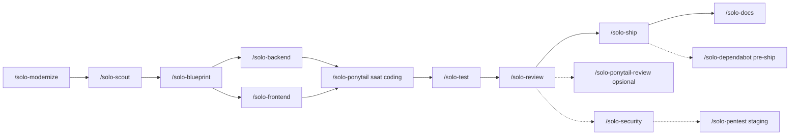

# Solo Squad — Skill On-Demand untuk Solo Developer

**Bahasa:** Indonesia · [English](../en/SOLO-SQUAD.md)

Tim virtual yang dipanggil saat perlu, untuk workflow full-stack solo. Semua command **`/solo-*`** — termasuk **`/solo-ponytail`** supaya coding tidak membengkak.

**Setup:** 2026-07-13 · **Versi:** [2.0.0](../../CHANGELOG.md) · [Release notes](../../RELEASE-NOTES.md)  
**Install dari GitHub:**

```bash
git clone https://github.com/BlackCoffeee/solo-squad.git
cd solo-squad && chmod +x scripts/*.sh && ./scripts/install.sh --lang id
```

Restart Cursor → `/solo-help`. Detail: [README.md](./README.md) · Atribusi: [ATTRIBUTION.md](../../ATTRIBUTION.md)

**Lokasi skill (setelah install):** `~/.cursor/skills/` (Cursor) · `~/.gemini/config/skills/` (Antigravity — lihat [PLATFORMS.md](../../PLATFORMS.md))  
**Keamanan:** Semua skill memakai `disable-model-invocation: true` — aktif hanya saat Anda memanggil `/nama-skill` (di Antigravity prefer slash command eksplisit).

**Lupa command?** Ketik **`/solo-help`** — menampilkan seluruh perintah Solo Squad beserta penjelasan.

**Diagram:** memakai kode Mermaid.

### Daftar isi

0. [`/solo-help`](#solo-help--daftar-command) — cheat sheet semua command
1. [Cara install di macOS, Linux, dan Windows](#cara-install-di-macos-linux-dan-windows)
2. [Daftar skill](#daftar-skill)
3. [Cara memanggil skill](#cara-memanggil-skill)
4. [Panduan tiap skill](#panduan-tiap-skill)
5. [Kapan pakai skill mana?](#kapan-pakai-skill-mana)
6. [Contoh kasus lengkap](#contoh-kasus-lengkap) (16 skenario)
7. [Alur kerja (diagram)](#alur-kerja-disarankan)
8. [Pilih stack](#pilih-stack-scout--blueprint)
9. [Keamanan skill](#keamanan)
10. [Struktur file](#struktur-file)
11. [Tips solo dev](#tips-solo-dev)
12. [Skill chaining & update bundled](#skill-chaining-satu-perintah)
13. [Review / keamanan / Dependabot](#review-keamanan--supply-chain--ringkasan)
14. [Audit script](#audit-script)

---

## Cara install di macOS, Linux, dan Windows

Langkahnya **sama** di semua OS: clone repo → jalankan `install.sh` → restart Cursor → `/solo-help`.

| | macOS | Linux | Windows |
|---|-------|-------|---------|
| **Terminal** | Terminal / iTerm | bash / zsh | **Git Bash** atau **WSL** (bukan CMD/PowerShell langsung) |
| **Prasyarat** | `git`, `python3` | `git`, `python3` | `git`, `python3`, Git for Windows atau WSL |
| **Path skill Cursor** | `~/.cursor/skills/` | `~/.cursor/skills/` | `%USERPROFILE%\.cursor\skills\` |
| **Perintah install** | `./scripts/install.sh` | `./scripts/install.sh` | sama (di Git Bash / WSL) |

Installer membutuhkan **bash** + **Python 3** (`apply-locale.py` untuk pilihan bahasa deskripsi skill).

### macOS

```bash
# Prasyarat: Xcode Command Line Tools (untuk git) — xcode-select --install
git clone https://github.com/BlackCoffeee/solo-squad.git
cd solo-squad
chmod +x scripts/*.sh
./scripts/install.sh --lang id    # atau --lang en
```

Python 3 biasanya sudah ada. Cek: `python3 --version`.

**Path skill:** `/Users/<username>/.cursor/skills/`

### Linux

```bash
# Debian/Ubuntu contoh prasyarat:
# sudo apt update && sudo apt install -y git python3

git clone https://github.com/BlackCoffeee/solo-squad.git
cd solo-squad
chmod +x scripts/*.sh
./scripts/install.sh --lang id
```

Fedora/Arch: pastikan paket `git` dan `python3` terinstall via package manager distro Anda.

**Path skill:** `/home/<username>/.cursor/skills/`

### Windows — Git Bash (disarankan)

Installer adalah **bash script**, bukan `.ps1` / `.bat`. Pakai **Git Bash** (terinstall bersama [Git for Windows](https://git-scm.com/download/win)).

```bash
git clone https://github.com/BlackCoffeee/solo-squad.git
cd solo-squad
chmod +x scripts/*.sh
./scripts/install.sh --lang id
```

Jika `python3` tidak dikenali, coba:

```bash
python --version
# atau install Python dari https://python.org (centang "Add to PATH")
```

**Path skill:** `C:\Users\<username>\.cursor\skills\`

Cursor di Windows membaca folder yang sama — skill muncul setelah restart IDE.

### Windows — WSL (alternatif)

Jalankan install di dalam WSL (Ubuntu, dll.). Skill terinstall ke home Linux WSL:

```bash
git clone https://github.com/BlackCoffeee/solo-squad.git
cd solo-squad
chmod +x scripts/*.sh
./scripts/install.sh --lang id
```

**Catatan:** Path skill = `~/.cursor/skills/` **di dalam WSL**. Cursor Desktop Windows biasanya memakai `%USERPROFILE%\.cursor\skills\`. Jika skill tidak muncul, salin manual:

```bash
# Dari WSL — sesuaikan username Windows
cp -r ~/.cursor/skills/solo-* /mnt/c/Users/<WindowsUser>/.cursor/skills/
```

Atau clone + install langsung di **Git Bash** agar path selaras dengan Cursor Windows.

### Opsi install (semua platform)

```bash
./scripts/install.sh --lang id                         # Cursor (default)
./scripts/install.sh --platform antigravity --lang id  # Antigravity
./scripts/install.sh --lang en
./scripts/install.sh --dry-run
SOLO_LANG=en ./scripts/install.sh
SOLO_SKILLS_DIR=/custom/path ./scripts/install.sh
```

Bahasa tersimpan di `.solo-squad-lang` pada path platform. Detail Antigravity: [PLATFORMS.md](../../PLATFORMS.md).

### Verifikasi setelah install

1. **Restart Cursor** (atau buka chat Agent baru)
2. Ketik **`/solo-help`** — harus muncul daftar command
3. Ketik **`/`** — harus ada `solo-scout`, `solo-backend`, `solo-ponytail`, dll.
4. **Customize → Skills** — 19 skill `solo-*` di scope **User**

### Install manual (tanpa script)

Jika bash/Python tidak tersedia, salin folder skill secara manual:

```text
skills/solo-*  →  ~/.cursor/skills/
```

Tanpa `install.sh`, deskripsi **tidak** dilokalisasi (`--lang` tidak jalan) dan referensi help mungkin masih `.id.md` / `.en.md` — disarankan pakai script.

### Troubleshooting install

| Masalah | Solusi |
|---------|--------|
| `Permission denied` saat `./scripts/install.sh` | `chmod +x scripts/*.sh` |
| `python3: command not found` (Windows) | Install Python; coba `python scripts/apply-locale.py` |
| Skill tidak muncul di Cursor | Restart Cursor; pastikan path `~/.cursor/skills/solo-help/SKILL.md` ada |
| Install di WSL, Cursor Windows tidak lihat skill | Salin ke `/mnt/c/Users/.../.cursor/skills/` atau pakai Git Bash |
| Ingin ganti bahasa deskripsi | `./scripts/install.sh --lang en` (ulang install) |

Setelah install berhasil, lanjut ke [Daftar skill](#daftar-skill).

---

## Daftar skill

| Skill | Peran | Kapan dipakai |
|-------|-------|---------------|
| `/solo-help` | **Cheat sheet** semua command | Lupa perintah, onboarding, lihat ringkasan cepat |
| `/solo-status` | Cek skill yang **masih aktif** di chat ini | Setelah beberapa `/solo-*`, sebelum ganti topik |
| `/solo-modernize` | Warisan + **improve-codebase-architecture** + **incremental-implementation** | Audit legacy, strategi migrasi — **fase 0** |
| `/solo-scout` | Analis + **grill-me-product** (terintegrasi) | Wawancara asumsi, scope, stack |
| `/solo-add-feature` | **Orkestrasi** fitur baru di app existing + **incremental-implementation** | Tambah modul ke codebase jadi — playbook scout→ship |
| `/solo-blueprint` | Planner + **grill-me-architecture** + Mermaid | Fase, task, diagram arsitektur |
| `/solo-backend` | Backend dev + **Engineering Best Practices** (terintegrasi) | Laravel, API, DB, OWASP — satu perintah |
| `/solo-frontend` | Frontend dev + **Taste Skill** (terintegrasi) | Next, React, Blade — satu perintah, anti-slop UI |
| `/solo-test` | QA + **Test-Driven Development** (terintegrasi) | Strategi, tulis test, jalankan, red-green-refactor |
| `/solo-review` | Review + **Code Review and Quality** (terintegrasi) | Sebelum merge — 5 axis: correctness, readability, architecture, security, performance |
| `/solo-security` | Audit + **Security and Hardening** (terintegrasi) | App sudah jadi, auth/payment/PII, threat model STRIDE, OWASP |
| `/solo-pentest` | Pentest web + **Web Pentest / OWASP WSTG** (terintegrasi) | Staging/localhost — verifikasi runtime setelah `/solo-security` |
| `/solo-dependabot` | Cek alert **Dependabot GitHub** + triage supply chain | Sebelum deploy, audit rutin, setelah bump dependency |
| `/solo-ship` | Release + **Shipping and Launch** (terintegrasi) | Tag, changelog, deploy checklist, rollback |
| `/solo-docs` | Docs + **Documentation and ADRs** (terintegrasi) | Dok sistem, panduan user, ADR |
| `/solo-ponytail` | Senior yang hemat kode | Saat **implementasi** — jangan over-build |
| `/solo-ponytail-ultra` | Ponytail intensitas ekstrem | Requirement bisa dipangkas; hapus dulu |
| `/solo-ponytail-review` | Review bloat saja | Opsional setelah `/solo-review` jika fokus over-engineering |
| `/solo-ponytail-status` | Cek Ponytail aktif di chat ini | Jawaban: **YA** atau **TIDAK** saja |

---

## `/solo-help` — daftar command

Menampilkan **seluruh perintah Solo Squad** (plus subagent Cursor terkait), dengan catatan singkat kapan dipakai.

| Sintaks | Output |
|---------|--------|
| `/solo-help` | Katalog lengkap (semua section) |
| `/solo-status` | Skill yang masih aktif di chat ini |
| `/solo-help plan` | modernize, scout, add-feature, blueprint |
| `/solo-help build` | backend, frontend, solo-ponytail |
| `/solo-help quality` | test, review, solo-ponytail-review |
| `/solo-help security` | security, pentest, dependabot, review-security |
| `/solo-help release` | ship, docs |
| `/solo-help solo-ponytail` | solo-ponytail, solo-ponytail-ultra, solo-ponytail-review, solo-ponytail-status |
| `/solo-help scout` | Detail satu skill (ganti `scout` dengan nama skill) |

`/solo-help` menjawab sekali lalu selesai. Untuk panduan lengkap, lihat dokumen ini. Cek skill yang masih aktif: **`/solo-status`**.

---

### `/solo-status` — skill yang masih aktif

Membaca riwayat **chat ini**, lalu daftar skill Solo Squad yang belum di-stop.

| Sintaks | Output |
|---------|--------|
| `/solo-status` | Daftar `/solo-*` yang aktif, atau “tidak ada yang aktif” |

**Satu jawaban lalu selesai** (sama seperti `/solo-help`). Tidak mengaktifkan atau mematikan skill.

**Contoh:**

```text
Aktif di chat ini:
- /solo-backend
- /solo-ponytail

Matikan: stop [nama] · atau normal mode
```

---

## Cara memanggil skill

### Dasar

1. Ketik **`/nama-skill`** di chat Cursor (mis. `/solo-scout`).
2. Tambahkan **konteks** setelah nama skill — fitur, modul, scope, atau perintah singkat.
3. Skill **tetap aktif** di chat itu sampai Anda mengetik perintah stop (lihat bawah).
4. Buka **folder project yang relevan** sebagai workspace — skill membaca kode di repo aktif.

```text
/solo-help                      # lihat semua command
/solo-status                    # cek skill yang masih aktif
/solo-scout sistem absensi karyawan
/solo-add-feature export PDF laporan bulanan
/solo-blueprint modul laporan
/solo-backend API export PDF
/solo-frontend halaman dashboard
/solo-test modul auth
/solo-review                    # review git diff
/solo-security audit full-app
/solo-pentest staging https://staging.app.com modul auth
/solo-dependabot critical
/solo-ship minor
/solo-docs both
/solo-ponytail                       # aktif saat implementasi
```

### Dua skill dalam satu pesan

Cursor bisa memuat lebih dari satu skill sekaligus:

```text
/solo-backend /solo-ponytail implementasi endpoint login
/solo-frontend /solo-ponytail form registrasi minimal
```

Gunakan saat **implementasi** — Ponytail menjaga solusi tetap minimal; skill dev menangani stack.

### Skill vs subagent bawaan Cursor

| Tipe | Contoh | Kapan |
|------|--------|-------|
| **Solo Squad skill** | `/solo-security` | Persona + bundled reference di chat yang sama |
| **Subagent** | `/review-security` | Context terpisah; audit diff fokus keamanan |
| **Subagent** | Task `explore` | Codebase besar; dipanggil agent saat perlu |

Subagent **tidak** menggantikan Solo Squad — dipasangkan setelah skill utama jika perlu second opinion.

### Matikan skill

| Perintah | Efek |
|----------|------|
| `stop scout` | Matikan `/solo-scout` |
| `stop add-feature` | Matikan `/solo-add-feature` |
| `stop blueprint` | Matikan `/solo-blueprint` |
| `stop modernize` | Matikan `/solo-modernize` |
| `stop solo-backend` | Matikan `/solo-backend` |
| `stop solo-frontend` | Matikan `/solo-frontend` |
| `stop solo-test` | Matikan `/solo-test` |
| `stop solo-review` | Matikan `/solo-review` |
| `stop solo-security` | Matikan `/solo-security` |
| `stop solo-pentest` | Matikan `/solo-pentest` |
| `stop solo-dependabot` | Matikan `/solo-dependabot` |
| `stop solo-ship` | Matikan `/solo-ship` |
| `stop solo-docs` | Matikan `/solo-docs` |
| `stop solo-ponytail` | Matikan Ponytail |
| `normal mode` | Matikan semua persona skill |

---

## Panduan tiap skill

### `/solo-modernize` — fase 0 warisan

**Kapan:** App lama, upgrade framework, migrasi stack, audit sebelum refactor besar.

| Sintaks contoh | Output |
|----------------|--------|
| `/solo-modernize` | Audit repo aktif |
| `/solo-modernize upgrade Laravel 8 ke 12` | Strategi in-place + roadmap |
| `/solo-modernize monolith PHP ke Laravel + Inertia` | Strangler / incremental |

**Tidak untuk:** Fitur greenfield baru dari nol (langsung `/solo-scout`).

**Stop:** `stop modernize` · **Lanjut:** `/solo-scout` pada **satu slice** fase 1.

---

### `/solo-scout` — analisis & scope

**Kapan:** Ide baru, fitur baru, fase migrasi, atau scope belum jelas.

| Sintaks contoh | Output |
|----------------|--------|
| `/solo-scout sistem booking ruang meeting` | Wawancara asumsi + scope + stack |
| `/solo-scout fase 1: modul auth saja` | Scope terbatas (setelah modernize) |
| `/solo-scout apakah perlu microservice?` | Rekomendasi monolith vs split |

**Tidak untuk:** Diagram arsitektur (pakai `/solo-blueprint`).

**Stop:** `stop scout` · **Lanjut:** `/solo-blueprint` atau `/solo-add-feature` jika app sudah ada.

---

### `/solo-add-feature` — tambah fitur ke app existing

**Kapan:** Fitur baru di **codebase yang sudah jalan** — bukan greenfield, bukan modernize penuh.

| Sintaks contoh | Output |
|----------------|--------|
| `/solo-add-feature notifikasi email booking` | Recon pola → scope → slice plan → next command |
| `/solo-add-feature lanjut fase 2` | Lanjut blueprint-lite jika scope sudah OK |
| `/solo-add-feature status` | Posisi playbook + skill berikutnya |

**Bundled:** [addyosmani/agent-skills](https://github.com/addyosmani/agent-skills) — `incremental-implementation`.

**Stop:** `stop add-feature` · **Pair:** `/solo-backend /solo-ponytail`, `/solo-test`, `/solo-review`, `/solo-ship`.

**Bukan untuk:** project baru dari nol (`/solo-scout`) · app warisan rusak (`/solo-modernize`).

---

### `/solo-blueprint` — rencana & diagram Mermaid

**Kapan:** Setelah scout; butuh fase, task list, diagram.

| Sintaks contoh | Output |
|----------------|--------|
| `/solo-blueprint modul booking` | Fase + checklist + ≥2 diagram Mermaid |
| `/solo-blueprint migrasi auth strangler` | Arsitektur dual-run + risiko |

**Wajib:** Semua diagram = blok ` ```mermaid `.

**Stop:** `stop blueprint` · **Lanjut:** `/solo-backend`, `/solo-frontend`, `/solo-ponytail`.

---

### `/solo-backend` — implementasi backend

**Kapan:** API, migration, model, auth server-side, job, integrasi DB.

| Sintaks contoh | Output |
|----------------|--------|
| `/solo-backend API booking CRUD` | Kode + validasi + smoke-test |
| `/solo-backend /solo-ponytail endpoint webhook` | Implementasi minimal |
| `/solo-backend migration tabel payments` | Migration + model |

**Stack:** Deteksi otomatis (Laravel, Node, Go, Python).

**Stop:** `stop solo-backend` · **Pair:** `/solo-ponytail`, `/solo-test`, `/solo-security` (auth/payment).

---

### `/solo-frontend` — implementasi frontend + Taste

**Kapan:** Halaman, komponen, wiring API, UI publik/landing.

| Sintaks contoh | Output |
|----------------|--------|
| `/solo-frontend halaman booking` | Route + komponen + states |
| `/solo-frontend landing page produk` | Taste Skill anti-slop |
| `/solo-frontend dashboard admin` | Pola project (Taste ringan) |

**Stop:** `stop solo-frontend` · **Pair:** `/solo-ponytail` jika UI membengkak.

---

### `/solo-test` — testing & TDD

**Kapan:** Sebelum merge, setelah fix bug, regression, fitur baru.

| Sintaks contoh | Output |
|----------------|--------|
| `/solo-test` | Strategi + jalankan suite relevan |
| `/solo-test modul auth` | Test fokus modul |
| `/solo-test regression setelah bump lodash` | Verifikasi setelah dependency fix |

**TDD:** Red-green-refactor untuk perilaku baru; skip untuk pure config/docs.

**Stop:** `stop solo-test` · **Pair:** `/solo-review` setelah hijau.

---

### `/solo-review` — review kualitas 5 axis

**Kapan:** Sebelum merge PR, setelah implementasi, review kode agent/manusia.

| Sintaks contoh | Output |
|----------------|--------|
| `/solo-review` | Review `git diff` |
| `/solo-review modul booking` | Review file modul |
| `/solo-review staged` | Review yang di-stage |

**Axis:** correctness, readability, architecture, security (ringan), performance.

**Verdict:** Approve · Approve with nits · Request changes.

**Stop:** `stop solo-review` · **Pair:** `/solo-ponytail-review` (bloat), `/solo-security` (audit dalam).

---

### `/solo-security` — audit keamanan

**Kapan:** App sudah jadi, modul auth/payment/PII, pre-ship publik, hardening.

| Sintaks contoh | Output |
|----------------|--------|
| `/solo-security audit full-app` | Threat model STRIDE + findings |
| `/solo-security modul auth` | Audit satu area |
| `/solo-security payment gateway` | Trust boundary + OWASP |
| `/solo-security pre-ship` | Checklist sebelum go-live |

**Default:** Read-only (daftar temuan, tidak auto-fix).

**Stop:** `stop solo-security` · **Pair:** `/solo-pentest` (runtime), `/review-security`, `/solo-dependabot`, `/solo-test`.

---

### `/solo-pentest` — pentest web terkontrol (staging)

**Kapan:** Setelah `/solo-security` atau untuk verifikasi runtime di app yang **sudah jalan**.

**Prasyarat:** Scope + otorisasi eksplisit. Default **staging / localhost** — production butuh frasa **"OK production"**.

| Sintaks contoh | Output |
|----------------|--------|
| `/solo-pentest staging https://staging.app.com` | Pentest scoped (WSTG) |
| `/solo-pentest localhost:8000 modul auth` | Fokus autentikasi |
| `/solo-pentest retest IDOR-1` | Uji ulang satu temuan |
| `/solo-pentest checklist` | Checklist WSTG tanpa probe aktif |

**Bundled:** [briiirussell/cybersecurity-skills](https://github.com/briiirussell/cybersecurity-skills) — `web-pentest` (MIT).

**Stop:** `stop solo-pentest` · **Pair:** `/solo-security` dulu, `/solo-test` setelah fix.

---

### `/solo-dependabot` — alert GitHub Dependabot

**Kapan:** Rutin, sebelum deploy, setelah bump dependency.

**Prasyarat (sekali):** `gh` (GitHub CLI) + login.

**Install `gh`:**

| OS | Perintah |
|----|----------|
| **macOS** | `brew install gh` |
| **Linux** | lihat [cli.github.com](https://cli.github.com/) — contoh Debian/Ubuntu: `sudo apt install gh` (atau pakai paket resmi GitHub) |
| **Windows** | `winget install GitHub.cli` · atau `choco install gh` · atau unduh dari [cli.github.com](https://cli.github.com/) |

**Login (semua OS):**

```bash
gh auth login
# GitHub.com → HTTPS → Login with browser
# Repo private: pastikan scope security_events (classic PAT)
# atau fine-grained: Dependabot alerts = read
```

Cek: `which gh && gh auth status` (Windows Git Bash/WSL: `gh --version && gh auth status`).

Alternatif: `export GH_TOKEN=...` (PAT, jangan commit). API Dependabot **selalu butuh auth** — tanpa login, agent hanya bisa audit lokal + link manual.

| Sintaks contoh | Output |
|----------------|--------|
| `/solo-dependabot` | Alert open repo aktif + cross-check lokal |
| `/solo-dependabot owner/repo` | Repo tertentu |
| `/solo-dependabot critical` | Filter critical + high |
| `/solo-dependabot org nama-org` | Org-wide (butuh permission) |

**Stop:** `stop solo-dependabot` · **Pair:** `/solo-test` setelah fix, `/solo-ship` setelah bersih.

---

### `/solo-ship` — release & deploy

**Kapan:** Tag release, changelog, checklist production.

| Sintaks contoh | Output |
|----------------|--------|
| `/solo-ship patch` | Preflight + semver patch |
| `/solo-ship minor` | Release minor + changelog |
| `/solo-ship` | Agent tanya patch/minor/major |

**Safety:** Tidak force-push, tidak deploy prod tanpa konfirmasi Anda.

**Stop:** `stop solo-ship` · **Preflight:** `/solo-test`, `/solo-dependabot`.

---

### `/solo-docs` — dokumentasi & ADR

**Kapan:** Setelah fase/release, keputusan arsitektur, panduan user.

| Sintaks contoh | Output |
|----------------|--------|
| `/solo-docs` | Dok sistem (default) |
| `/solo-docs system` | Setup dev, arsitektur, API |
| `/solo-docs user` | Panduan end-user |
| `/solo-docs both` | Sistem + user |
| `/solo-docs ADR keputusan migrasi auth` | ADR + konteks |

**Stop:** `stop solo-docs` · Diagram wajib Mermaid jika ada.

---

### `/solo-ponytail` — jangan over-engineering saat coding

Persona [DietrichGebert/ponytail](https://github.com/DietrichGebert/ponytail) · [ponytail.dev](https://ponytail.dev/) — sudah masuk playbook Solo Squad sebagai **`/solo-ponytail`** (on-demand, install bersama skill lain). Anda tidak perlu mengonfigurasi Ponytail terpisah.

#### Apa itu?

Membuat agent berperilaku seperti **senior developer efisien** — bukan ceroboh, tapi **tidak suka over-engineering**.

| Tanpa solo-ponytail | Dengan solo-ponytail |
|---------------------|----------------------|
| Install library date picker + wrapper + CSS | `<input type="date">` |
| Class `CacheManager` 50 baris | `@lru_cache(maxsize=1000)` |
| Abstract factory untuk satu implementasi | Inline langsung, YAGNI |

Validasi, keamanan, error handling, dan aksesibilitas **tetap wajib** — bukan soal kode sependek mungkin semata.

#### Skill & intensitas

| Skill | Kapan | Intensitas |
|-------|-------|------------|
| `/solo-ponytail` | Implementasi sehari-hari | Full (default) |
| `/solo-ponytail lite` | Sedikit lebih longgar | Lite |
| `/solo-ponytail-ultra` | Tantang requirement, hapus dulu | Ultra |
| `/solo-ponytail-review` | Review diff fokus simplifikasi | Sekali jalan |
| `/solo-ponytail-status` | Cek aktif/tidak di chat ini | `YA` / `TIDAK` saja |

| Level | Perilaku |
|-------|----------|
| **lite** | Build yang diminta + sebut alternatif lebih sederhana |
| **full** | Default — stdlib/native first, diff terpendek |
| **ultra** | Tantang requirement, hapus sebelum tambah |

#### Cara pakai

```text
/solo-ponytail tambahkan validasi email di form register, tanpa library baru
/solo-backend /solo-ponytail implementasi endpoint login minimal
/solo-ponytail-ultra apakah fitur export PDF ini benar-benar perlu?
/solo-ponytail-review
/solo-ponytail-status
stop solo-ponytail
normal mode
```

Pair saat implementasi: `/solo-backend /solo-ponytail` atau `/solo-frontend /solo-ponytail`.

#### Decision ladder

Agent menaiki tangga ini dan **berhenti di anak tangga pertama yang sudah cukup**:

1. Apakah fitur ini perlu ada? → Spekulatif = skip (YAGNI)
2. Sudah ada di codebase? → Reuse pattern yang ada
3. Standard library sudah bisa? → Pakai itu
4. Fitur native platform cukup? → HTML, CSS, DB constraint, dll.
5. Dependency terpasang sudah bisa? → Jangan tambah library baru
6. Bisa satu baris? → Satu baris
7. Baru kemudian → Kode minimum yang benar-benar bekerja

#### Komentar `ponytail:`

Shortcut sengaja bisa ditandai intent-nya:

```python
# ponytail: global lock cukup untuk <100 req/s; upgrade ke Redis jika throughput naik
```

#### Kapan cocok / kurang cocok

**Cocok:** bug fix kecil, util sederhana, form UI, refactor over-engineered, pilih library vs stdlib, review PR.

**Kurang cocok:** desain arsitektur sistem besar dari nol; domain yang memang butuh abstraksi (payment, auth kompleks); task yang Anda sengaja minta extensible/future-proof.

#### Verifikasi & troubleshooting

1. Restart Cursor atau buka chat **Agent** baru
2. Ketik `/` — harus muncul `solo-ponytail`, `solo-ponytail-ultra`, `solo-ponytail-review`, `solo-ponytail-status`
3. Customize → Skills → scope **User**

| Masalah | Solusi |
|---------|--------|
| `/solo-ponytail` tidak muncul | Restart Cursor; pakai Agent mode (bukan Ask) |
| Ponytail selalu aktif | Cek tidak ada User Rule / `.cursor/rules/` Ponytail `alwaysApply: true` |
| Nonaktif permanen | Hapus folder `~/.cursor/skills/solo-ponytail*` |

**Stop:** `stop solo-ponytail` atau `normal mode`.

---

## Kapan pakai skill mana?

| Situasi | Mulai dengan | Lalu (urutan) |
|---------|--------------|---------------|
| Lupa command / onboarding | `/solo-help` | — |
| Cek skill yang masih aktif | `/solo-status` | — |
| Fitur baru greenfield | `/solo-scout` | blueprint → backend/frontend + ponytail → test → review → ship → docs |
| Fitur baru di app existing | `/solo-add-feature` | implement per next command → test → review → ship → docs |
| App warisan / legacy | `/solo-modernize` | scout (1 fase) → blueprint → implement → test → review → ship → docs |
| App jadi — cek keamanan | `/solo-security audit full-app` | pentest staging → test → dependabot → docs ADR |
| Verifikasi runtime (staging) | `/solo-pentest staging [URL]` | setelah `/solo-security`; retest setelah fix |
| Bug di production | `/solo-test` + repro | ponytail fix minimal → review → ship patch |
| Hanya backend | `/solo-backend /solo-ponytail` | test → review |
| Hanya frontend | `/solo-frontend /solo-ponytail` | test → review |
| Landing page / UI publik | `/solo-frontend` (Taste otomatis) | review → ship |
| Auth / payment / PII baru | `/solo-scout` → `/solo-blueprint` | backend + `/solo-security` → test → review |
| Sebelum merge PR | `/solo-test` → `/solo-review` | solo-ponytail-review (opsional) |
| Sebelum deploy prod | `/solo-dependabot` → `/solo-test` | ship |
| Dependency CVE terbuka | `/solo-dependabot critical` | fix → test → dependabot lagi → ship |
| Kualitas kode umum | `/solo-review` | — |
| Hanya cek bloat | `/solo-ponytail-review` | — |
| Security second opinion (diff) | `/review-security` | setelah solo-security atau solo-review |
| Dokumentasi saja | `/solo-docs both` | — |
| Explore codebase besar | Agent explore | lalu modernize atau scout |

---

## Contoh kasus lengkap

### 1. Fitur baru greenfield (full flow)

```text
1. /solo-scout sistem booking ruang meeting untuk kampus
2. /solo-blueprint modul booking
3. /solo-backend API booking + migration
4. /solo-ponytail implementasi minimal sesuai blueprint
5. /solo-frontend halaman booking
6. /solo-test modul booking
7. /solo-review modul booking
8. /solo-dependabot
9. /solo-ship minor
10. /solo-docs both
```

### 2. Aplikasi warisan — modernisasi bertahap

```text
1. /solo-modernize upgrade Laravel 8 monolith ke Laravel 12 + Inertia
2. /solo-scout fase 1: modul auth saja
3. /solo-blueprint migrasi auth strangler
4. /solo-backend /solo-ponytail implementasi slice 1
5. /solo-test regression auth
6. /solo-review diff auth
7. /solo-ship patch
8. /solo-docs system → ADR keputusan migrasi
```

### 3. App sudah jadi — audit keamanan + pentest staging

```text
1. Buka folder app di Cursor
2. /solo-security audit full-app
3. /solo-pentest staging https://staging.app.com modul auth
4. (opsional) /review-security
5. Fix temuan critical/high
6. /solo-test regression
7. /solo-pentest retest [finding-id]
8. /solo-dependabot
9. /solo-docs ADR hardening wave 1
```

### 4. Cek Dependabot sebelum deploy

```text
1. Buka repo terhubung GitHub
2. /solo-dependabot
3. Fix critical/high → commit
4. /solo-test
5. /solo-dependabot critical    # verifikasi bersih
6. /solo-ship patch
```

### 5. Hotfix bug production

```text
1. /solo-test reproduksi bug checkout timeout
2. /solo-ponytail fix root cause minimal
3. /solo-test regression checkout
4. /solo-review
5. /solo-ship patch
```

### 6. Modul auth sensitif (baru)

```text
1. /solo-scout modul SSO untuk admin
2. /solo-blueprint auth + session flow
3. /solo-backend /solo-ponytail implementasi
4. /solo-security modul auth
5. /solo-test modul auth
6. /solo-review
7. /solo-docs system + ADR auth
```

### 7. Hanya review sebelum merge

```text
1. /solo-test
2. /solo-review
3. (opsional) /solo-ponytail-review
```

### 8. Refactor tanpa fitur baru

```text
1. /solo-blueprint refactor service layer invoice
2. /solo-ponytail refactor incremental
3. /solo-test regression invoice
4. /solo-review
5. /solo-ship patch
```

### 9. Landing page

```text
1. /solo-scout landing page produk SaaS
2. /solo-blueprint halaman + CTA flow
3. /solo-frontend landing page   # Taste Skill otomatis
4. /solo-review
5. /solo-ship minor
6. /solo-docs user
```

### 10. Monolith → API terpisah untuk mobile

```text
1. /solo-scout mobile app + API existing Laravel
2. /solo-blueprint ekstrak API v1 dari monolith
3. /solo-modernize   # jika codebase sulit — opsional fase 0
4. /solo-backend /solo-ponytail endpoint v1
5. /solo-test API contract
6. /solo-security API auth
7. /solo-docs system API v1
```

### 11. Bump dependency setelah alert CVE

```text
1. /solo-dependabot critical
2. Bump package + update lockfile (Anda approve)
3. /solo-test
4. /solo-dependabot
5. /solo-ship patch
```

### 12. Org dengan banyak repo (security manager)

```text
1. /solo-dependabot org nama-organisasi
2. Prioritaskan repo production
3. Per repo: fix → test → ship
```

### 13. Dokumentasi setelah rilis tanpa fitur baru

```text
1. /solo-docs both modul yang baru dirilis v2.3
```

### 14. Test dulu, baru kode (fitur kecil)

```text
1. /solo-scout validasi email domain kampus
2. /solo-test tulis test validator dulu
3. /solo-backend /solo-ponytail implementasi sampai hijau
4. /solo-review
```

### 16. Tambah fitur ke app Laravel/Next yang sudah jalan

```text
1. /solo-add-feature reminder WhatsApp modul booking
2. (agent arahkan) /solo-backend /solo-ponytail webhook reminder
3. /solo-frontend /solo-ponytail toggle reminder di halaman booking
4. /solo-test modul reminder
5. /solo-review
6. /solo-dependabot
7. /solo-ship minor
8. /solo-docs user
```

---

## Alur kerja disarankan



`/solo-modernize` opsional — **wajib untuk aplikasi warisan**; skip untuk greenfield.

Contoh langkah demi langkah: lihat **[Contoh kasus lengkap](#contoh-kasus-lengkap)** (kasus 1 greenfield, kasus 2 warisan).

---

## Pilih stack (scout + blueprint)

| Kebutuhan | Rekomendasi umum |
|-----------|------------------|
| CRUD + auth + admin, satu deploy | Laravel atau Next.js full-stack |
| Mobile app + API | BE terpisah (Laravel/API) + FE React/Next |
| SEO + marketing + app | Next.js |
| Sudah ada codebase | **Ikuti stack project** — skill mendeteksi otomatis |

---

## Keamanan

| Guardrail | Keterangan |
|-----------|------------|
| `disable-model-invocation: true` | Tidak auto-aktif |
| Tanpa folder `scripts/` | Tidak ada executable tersembunyi |
| `/solo-ship` | Tidak force-push, tidak deploy prod tanpa konfirmasi Anda |
| Input validation | Backend/frontend skill mewajibkan validasi di trust boundary |

Audit berkala:

```bash
./scripts/solo-skills-audit.sh --check  # 19 skill solo-* (keamanan)
./scripts/solo-skills-audit.sh          # + diff bundled vs upstream
./scripts/solo-ponytail-diff.sh --check # solo-ponytail vs upstream DietrichGebert/ponytail
./scripts/solo-ponytail-diff.sh         # audit + diff upstream (butuh internet)
./scripts/solo-ponytail-diff.sh --hash  # SHA256 lokal vs upstream
```

---

## Struktur file

```
~/.cursor/skills/
├── solo-status/
├── solo-ponytail/
├── solo-ponytail-ultra/
├── solo-ponytail-review/
├── solo-ponytail-status/
├── solo-help/
│   ├── SKILL.md
│   └── references/
│       └── solo-squad-help.md
├── solo-modernize/
│   ├── SKILL.md
│   └── references/
│       ├── improve-codebase-architecture.md
│       └── incremental-implementation.md
├── solo-scout/
│   ├── SKILL.md
│   └── references/
│       └── grill-me-product.md
├── solo-add-feature/
│   ├── SKILL.md
│   └── references/
│       └── incremental-implementation.md
├── solo-blueprint/
│   ├── SKILL.md
│   └── references/
│       └── grill-me-architecture.md
├── solo-backend/
│   ├── SKILL.md
│   └── references/
│       └── engineering-best-practices.md
├── solo-frontend/
│   ├── SKILL.md
│   └── references/
│       └── taste-skill.md
├── solo-test/
│   ├── SKILL.md
│   └── references/
│       └── test-driven-development.md
├── solo-review/
│   ├── SKILL.md
│   └── references/
│       └── code-review-and-quality.md
├── solo-security/
│   ├── SKILL.md
│   └── references/
│       └── security-and-hardening.md
├── solo-pentest/
│   ├── SKILL.md
│   └── references/
│       └── web-pentest.md
├── solo-dependabot/
│   ├── SKILL.md
│   └── references/
│       └── dependabot-github-audit.md
├── solo-ship/
│   ├── SKILL.md
│   └── references/
│       └── shipping-and-launch.md
├── solo-docs/
│   ├── SKILL.md
│   └── references/
│       └── documentation-and-adrs.md
```

---

## Tips solo dev

1. **Satu fase, satu skill** — lihat [Kapan pakai skill mana?](#kapan-pakai-skill-mana).
2. **Ponytail saat coding** — scout/blueprint saat berpikir.
3. **Preflight deploy:** `/solo-dependabot` → `/solo-test` → `/solo-ship`.
4. **App warisan:** `/solo-modernize` dulu, lalu scout **satu slice** per sesi.
5. **Docs** per fase atau setelah ship — jangan tunggu sampai basi.
6. **Stop skill** saat ganti topik — [daftar perintah stop](#matikan-skill).

---

## Skill chaining (satu perintah)

Beberapa skill Solo memuat persona komunitas di dalamnya — Anda tidak perlu memanggil dua perintah.

| Perintah Anda | Yang dijalankan di belakang |
|---------------|----------------------------|
| `/solo-help` | Katalog command (`references/solo-squad-help.md`) |
| `/solo-status` | Cek skill yang masih aktif di chat ini |
| `/solo-modernize` | Audit warisan + **improve-codebase-architecture** + **incremental-implementation** |
| `/solo-scout` | Solo scout + **grill-me-product** (`references/grill-me-product.md`) |
| `/solo-add-feature` | Orkestrasi fitur + **Incremental Implementation** (`references/incremental-implementation.md`) |
| `/solo-blueprint` | Solo blueprint + **grill-me-architecture** (`references/grill-me-architecture.md`) |
| `/solo-frontend` | Solo frontend + **Taste Skill** (`references/taste-skill.md`) |
| `/solo-backend` | Solo backend + **Engineering Best Practices** (`references/engineering-best-practices.md`) |
| `/solo-test` | Solo test + **Test-Driven Development** (`references/test-driven-development.md`) |
| `/solo-review` | Solo review + **Code Review and Quality** (`references/code-review-and-quality.md`) |
| `/solo-security` | Solo security + **Security and Hardening** (`references/security-and-hardening.md`) |
| `/solo-pentest` | Solo pentest + **Web Pentest / OWASP WSTG** (`references/web-pentest.md`) |
| `/solo-dependabot` | Dependabot GitHub audit (`references/dependabot-github-audit.md` — custom) |
| `/solo-ship` | Solo ship + **Shipping and Launch** (`references/shipping-and-launch.md`) |
| `/solo-docs` | Solo docs + **Documentation and ADRs** (`references/documentation-and-adrs.md`) |

### Update bundled references

**Incremental Implementation (add-feature):**

```bash
curl -fsSL -o ~/.cursor/skills/solo-add-feature/references/incremental-implementation.md \
  https://raw.githubusercontent.com/addyosmani/agent-skills/main/skills/incremental-implementation/SKILL.md
```

**Improve Codebase Architecture + Incremental Implementation (modernize):**

```bash
curl -fsSL -o ~/.cursor/skills/solo-modernize/references/improve-codebase-architecture.md \
  https://raw.githubusercontent.com/mattpocock/skills/main/skills/engineering/improve-codebase-architecture/SKILL.md

curl -fsSL -o ~/.cursor/skills/solo-modernize/references/incremental-implementation.md \
  https://raw.githubusercontent.com/addyosmani/agent-skills/main/skills/incremental-implementation/SKILL.md
```

Sumber: [mattpocock/skills](https://github.com/mattpocock/skills) · [addyosmani/agent-skills](https://github.com/addyosmani/agent-skills)

**Grill Me Product (scout):**

```bash
curl -fsSL -o ~/.cursor/skills/solo-scout/references/grill-me-product.md \
  https://raw.githubusercontent.com/sergdort/dot-files/main/grill-me-product/SKILL.md
```

Sumber: [sergdort/dot-files](https://github.com/sergdort/dot-files) (MIT, adapted from Matt Pocock)

**Grill Me Architecture (blueprint):**

```bash
curl -fsSL -o ~/.cursor/skills/solo-blueprint/references/grill-me-architecture.md \
  https://raw.githubusercontent.com/sergdort/dot-files/main/grill-me-architecture/SKILL.md
```

**Taste Skill (frontend):**

```bash
curl -fsSL -o ~/.cursor/skills/solo-frontend/references/taste-skill.md \
  https://raw.githubusercontent.com/Leonxlnx/taste-skill/main/skills/taste-skill/SKILL.md
```

Sumber: [Leonxlnx/taste-skill](https://github.com/Leonxlnx/taste-skill)

**Engineering Best Practices (backend):**

```bash
curl -fsSL -o ~/.cursor/skills/solo-backend/references/engineering-best-practices.md \
  https://raw.githubusercontent.com/skylarng89/engineering-best-practices-skill/main/SKILL.md
```

Sumber: [skylarng89/engineering-best-practices-skill](https://github.com/skylarng89/engineering-best-practices-skill)

**Test-Driven Development (test):**

```bash
curl -fsSL -o ~/.cursor/skills/solo-test/references/test-driven-development.md \
  https://raw.githubusercontent.com/addyosmani/agent-skills/main/skills/test-driven-development/SKILL.md
```

Sumber: [addyosmani/agent-skills](https://github.com/addyosmani/agent-skills)

**Code Review and Quality (review):**

```bash
curl -fsSL -o ~/.cursor/skills/solo-review/references/code-review-and-quality.md \
  https://raw.githubusercontent.com/addyosmani/agent-skills/main/skills/code-review-and-quality/SKILL.md
```

**Security and Hardening (security):**

```bash
curl -fsSL -o ~/.cursor/skills/solo-security/references/security-and-hardening.md \
  https://raw.githubusercontent.com/addyosmani/agent-skills/main/skills/security-and-hardening/SKILL.md
```

**Web Pentest / OWASP WSTG (pentest):**

```bash
curl -fsSL -o ~/.cursor/skills/solo-pentest/references/web-pentest.md \
  https://raw.githubusercontent.com/briiirussell/cybersecurity-skills/main/skills/web-pentest/SKILL.md
```

Sumber: [briiirussell/cybersecurity-skills](https://github.com/briiirussell/cybersecurity-skills) (MIT)

---

## Review, keamanan & supply chain — ringkasan

| Kebutuhan | Perintah |
|-----------|----------|
| Lihat semua command | `/solo-help` |
| Cek skill yang masih aktif | `/solo-status` |
| Review lengkap sebelum merge | `/solo-review` |
| Audit keamanan app / modul sensitif | `/solo-security` |
| Pentest runtime (staging/localhost) | `/solo-pentest` — pair setelah `/solo-security` |
| Alert Dependabot GitHub | `/solo-dependabot` |
| Cek bloat saja | `/solo-ponytail-review` |
| Second opinion keamanan (subagent) | `/review-security` |

Detail sintaks dan contoh: [Panduan tiap skill](#panduan-tiap-skill) · [Contoh kasus 3–4, 11, 15](#contoh-kasus-lengkap).

---

## Audit script

`scripts/solo-skills-audit.sh` — audit keamanan **19 skill** Solo Squad + diff bundled vs upstream.

```bash
./scripts/solo-skills-audit.sh --check   # keamanan saja (offline)
./scripts/solo-skills-audit.sh           # keamanan + diff upstream
./scripts/solo-skills-audit.sh --hash    # SHA256 saja
```

### Audit solo-ponytail

`scripts/solo-ponytail-diff.sh` — bandingkan `solo-ponytail*` lokal vs [DietrichGebert/ponytail](https://github.com/DietrichGebert/ponytail).

| Cek | Keterangan |
|-----|------------|
| `disable-model-invocation: true` | Skill tidak auto-aktif |
| Script executable | Tidak ada `.py`/`.sh`/`.js` di folder skill |
| Diff upstream | `solo-ponytail`, `solo-ponytail-review` vs repo resmi |
| Local-only | `solo-ponytail-ultra`, `solo-ponytail-status` — audit keamanan saja |

Exit code `1` setelah diff **bukan berarti berbahaya** — adaptasi lokal (locale, Solo Squad prefix) wajar. Review manual sebelum merge update upstream.

Update manual dari upstream (pastikan `disable-model-invocation: true` tetap ada):

```bash
curl -fsSL -o ~/.cursor/skills/solo-ponytail/SKILL.md \
  https://raw.githubusercontent.com/DietrichGebert/ponytail/main/skills/ponytail/SKILL.md
# lalu ./scripts/install.sh --lang id  # re-apply locale & Solo Squad adaptasi
```

**Shipping and Launch (ship):**

```bash
curl -fsSL -o ~/.cursor/skills/solo-ship/references/shipping-and-launch.md \
  https://raw.githubusercontent.com/addyosmani/agent-skills/main/skills/shipping-and-launch/SKILL.md
```

**Documentation and ADRs (docs):**

```bash
curl -fsSL -o ~/.cursor/skills/solo-docs/references/documentation-and-adrs.md \
  https://raw.githubusercontent.com/addyosmani/agent-skills/main/skills/documentation-and-adrs/SKILL.md
```

---

## Referensi

- [DietrichGebert/ponytail](https://github.com/DietrichGebert/ponytail) · [ponytail.dev](https://ponytail.dev/) — upstream solo-ponytail persona
- [Cursor Agent Skills](https://cursor.com/docs/context/skills)
- [Cursor Subagents](https://cursor.com/docs/subagents)
